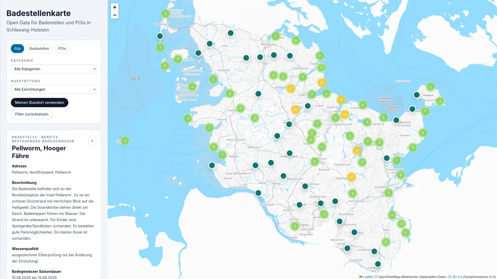

# Open Bath Map

Interaktive Open-Data-Kartenanwendung für Badestellen und wassernahe POIs in Schleswig-Holstein.



## Überblick

Open Bath Map kombiniert ein Nuxt-3-Frontend mit einem FastAPI-Backend. Die Anwendung lädt offene Badegewässer-Daten des Landes Schleswig-Holstein, normalisiert sie serverseitig und stellt sie über eine gemeinsame Karten-API für eine interaktive Leaflet-Karte bereit. Zusätzlich können lokale POIs aus einer JSON-Datei eingebunden werden.

Die Karte ist auf eine schnelle, kartenzentrierte Nutzung ausgelegt:

- Marker werden bounds-basiert nachgeladen, sobald sich der sichtbare Kartenausschnitt ändert.
- Detailansichten sind über sprechende Slugs direkt verlinkbar.
- Auf Mobilgeräten gibt es eine Standortfunktion und ein Bottom Sheet.
- Die Anwendung ist zusätzlich als installierbare PWA konfiguriert.

## Stack

- Frontend: Nuxt 3, Vue 3, TypeScript, Tailwind CSS, Leaflet, `leaflet.markercluster`
- Backend: FastAPI, Pydantic, `httpx`, `pydantic-settings`
- Datenquellen: CKAN/Open-Data-Portal Schleswig-Holstein plus lokale POI-Datei
- Auslieferung: SSR-fähiges Nuxt-Frontend, JSON-Datei-Cache im Backend, PWA-Manifest und Service Worker

## Kernfunktionen

- Interaktive Karte für Badestellen und zusätzliche wassernahe POIs
- Marker-Clustering mit deaktiviertem Clustering auf hohem Zoom
- Bounds-basierte Marker-Abfrage über `/api/map/v1/bounds`
- Radius-Abfrage auf Basis des Browser-Standorts über `/api/map/v1/radius`
- Detaildaten für Marker über `/api/map/v1/details`
- SEO-fähige Detailrouten über `/<slug>`
- Filter für Typ, Kategorie und Infrastruktur
- Rechtsseiten für Impressum und Datenschutz auf Basis von `.env`-Werten
- Installierbare PWA mit Manifest, Homescreen-Icons und Service Worker

## Architektur

### Frontend

Das Frontend ist ein Nuxt-3-Projekt unter [`frontend`](/home/awendelk/git/open-bath-map/frontend). Die eigentliche Kartenlogik liegt in [`MapExperience.vue`](/home/awendelk/git/open-bath-map/frontend/components/map/MapExperience.vue). Diese Komponente verbindet:

- Kartenansicht über [`MapView.vue`](/home/awendelk/git/open-bath-map/frontend/components/map/MapView.vue)
- Desktop-Detailbereich über [`MapSidebar.vue`](/home/awendelk/git/open-bath-map/frontend/components/map/MapSidebar.vue)
- Mobile Interaktion über [`MapBottomSheet.vue`](/home/awendelk/git/open-bath-map/frontend/components/map/MapBottomSheet.vue)
- Filter- und Auswahlzustand über die Composables

Zentrale Frontend-Bausteine:

- [`useMapState.ts`](/home/awendelk/git/open-bath-map/frontend/composables/useMapState.ts): globaler Karten-, Filter- und UI-Zustand über Nuxt `useState`
- [`useMapData.ts`](/home/awendelk/git/open-bath-map/frontend/composables/useMapData.ts): Marker- und Detailabfragen, Request-Sequencing gegen Race Conditions
- [`useMapSelection.ts`](/home/awendelk/git/open-bath-map/frontend/composables/useMapSelection.ts): Synchronisierung zwischen Auswahlzustand und slug-basierter Route
- [`useGeolocation.ts`](/home/awendelk/git/open-bath-map/frontend/composables/useGeolocation.ts): Browser-Geolocation mit Fehlerbehandlung

Die Route [`frontend/pages/[[slug]].vue`](/home/awendelk/git/open-bath-map/frontend/pages/[[slug]].vue) lädt Detaildaten bereits serverseitig vor, damit Meta-Titel und Meta-Beschreibung auch auf Detailseiten korrekt gesetzt werden.

### Backend

Das Backend lebt unter [`backend`](/home/awendelk/git/open-bath-map/backend) und stellt drei API-Bereiche bereit:

- [`/api/health`](/home/awendelk/git/open-bath-map/backend/app/api/routes/health.py)
- [`/api/bathing-sites`](/home/awendelk/git/open-bath-map/backend/app/api/routes/bathing_sites.py)
- [`/api/map/v1`](/home/awendelk/git/open-bath-map/backend/app/api/routes/map.py)

Die zentrale Fachlogik steckt in [`opendata.py`](/home/awendelk/git/open-bath-map/backend/app/services/opendata.py). Der Service übernimmt:

- Discovery der CSV-Quellen über die CKAN-API
- Fallback auf bekannte direkte EFI-CSV-URLs
- Laden und Normalisieren mehrerer Teilquellen
- Zusammenführen von Stammdaten, Einstufung, Infrastruktur, Saison und Messungen
- Berechnung von Entfernungen per Haversine
- Aufbereitung einer kombinierten Kartenrepräsentation für Badestellen und POIs
- Schreiben und Lesen eines JSON-Datei-Caches

### Datenmodell

Das Backend verwendet zwei Hauptmodelle:

- [`BathingSite`](/home/awendelk/git/open-bath-map/backend/app/models/bathing_site.py) für die rohe bzw. fachliche Sicht auf Badegewässer
- [`MapItem`](/home/awendelk/git/open-bath-map/backend/app/models/map_item.py) für die vereinheitlichte Darstellung auf der Karte

Badestellen werden aus den Landesdaten erzeugt. Zusätzliche POIs kommen aus [`backend/app/data/pois.json`](/home/awendelk/git/open-bath-map/backend/app/data/pois.json). Beide Typen werden in der Karten-API zu einem gemeinsamen Format zusammengeführt.

## Datenfluss

1. Das Frontend lädt Marker anhand des sichtbaren Kartenausschnitts oder einer Radius-Abfrage.
2. Das Backend lädt bei Bedarf die Open-Data-Quellen, normalisiert sie und cached das Ergebnis lokal.
3. Die Karten-API liefert GeoJSON-artige Features plus Filter-Metadaten zurück.
4. Beim Klick auf einen Marker lädt das Frontend Detaildaten nach.
5. Die Auswahl wird in eine slug-basierte Route synchronisiert, damit Detailseiten direkt teilbar sind.

## Projektstruktur

```text
.
├── backend
│   ├── app
│   │   ├── api/routes
│   │   ├── data
│   │   ├── models
│   │   └── services
│   └── pyproject.toml
├── frontend
│   ├── assets/css
│   ├── components
│   │   ├── map
│   │   └── site
│   ├── composables
│   ├── pages
│   ├── public
│   ├── types
│   ├── utils
│   ├── nuxt.config.ts
│   └── package.json
├── screenshot_badestellenkarte.webp
└── .env.example
```

## Open-Data-Quellen

Die Anwendung verarbeitet mehrere fachliche CSV-Quellen aus Schleswig-Holstein:

- Badegewässer Stammdaten
- Badegewässer Einstufung
- Badegewässer Infrastruktur
- Badegewässer Saisondauer
- Badegewässer Messungen

Der Service versucht URLs über die CKAN-API zu ermitteln:

- `https://opendata.schleswig-holstein.de/api/3/action/package_search`

Für mehrere Datensätze sind direkte Fallback-URLs hinterlegt, unter anderem:

- `http://efi2.schleswig-holstein.de/bg/opendata/v_badegewaesser_odata.csv`
- `http://efi2.schleswig-holstein.de/bg/opendata/v_einstufung_odata.csv`
- `http://efi2.schleswig-holstein.de/bg/opendata/v_infrastruktur_odata.csv`
- `http://efi2.schleswig-holstein.de/bg/opendata/v_badesaison_odata.csv`
- `http://efi2.schleswig-holstein.de/bg/opendata/v_proben_odata.csv`

## Voraussetzungen

- Node.js 20+
- `pnpm`
- Python 3.12+

## Installation und lokaler Start

### 1. Umgebungsvariablen anlegen

```bash
cp .env.example .env
```

### 2. Frontend-Abhängigkeiten installieren

```bash
pnpm --dir frontend install
```

### 3. Backend-Umgebung anlegen

```bash
cd backend
python3.12 -m venv .venv
source .venv/bin/activate
pip install -e .
```

### 4. Backend starten

```bash
cd backend
source .venv/bin/activate
uvicorn app.main:app --reload --host 127.0.0.1 --port 8000
```

### 5. Frontend starten

```bash
pnpm dev:frontend
```

Lokale URLs:

- Frontend: `http://127.0.0.1:3000`
- Backend: `http://127.0.0.1:8000`

## Build

Frontend-Produktionsbuild:

```bash
pnpm build:frontend
```

Frontend-Vorschau:

```bash
pnpm preview:frontend
```

Backend produktionsnah:

```bash
cd backend
source .venv/bin/activate
uvicorn app.main:app --host 0.0.0.0 --port 8000
```

## Umgebungsvariablen

### Frontend

| Variable | Bedeutung |
| --- | --- |
| `NUXT_PUBLIC_API_BASE` | Basis-URL des FastAPI-Backends |
| `NUXT_PUBLIC_SITE_URL` | Öffentliche Basis-URL des Frontends für Canonical-Links und SEO |
| `NUXT_PUBLIC_CONTACT_MAIL` | Kontakt-E-Mail für Impressum und Datenschutz |
| `NUXT_PUBLIC_CONTACT_PHONE` | Telefonnummer für das Impressum |
| `NUXT_PUBLIC_PRIVACY_CONTACT_PERSON` | Verantwortliche Person für Datenschutzangaben |
| `NUXT_PUBLIC_ADDRESS_NAME` | Name der Organisation |
| `NUXT_PUBLIC_ADDRESS_STREET` | Straße |
| `NUXT_PUBLIC_ADDRESS_HOUSE_NUMBER` | Hausnummer |
| `NUXT_PUBLIC_ADDRESS_POSTAL_CODE` | Postleitzahl |
| `NUXT_PUBLIC_ADDRESS_CITY` | Ort |

### Backend

| Variable | Bedeutung |
| --- | --- |
| `BACKEND_HOST` | Host für den FastAPI-Server |
| `BACKEND_PORT` | Port für den FastAPI-Server |
| `BACKEND_CORS_ORIGINS` | Kommaseparierte Liste erlaubter Origins |
| `CACHE_TTL_MINUTES` | Gültigkeit des Datei-Caches in Minuten |
| `REQUEST_TIMEOUT_SECONDS` | Timeout für Requests auf externe Datenquellen |

## API-Überblick

### `GET /api/health`

Liefert Health-Status, Cache-Alter, Cache-Zeitpunkt, erkannte Quell-URLs und die Anzahl der geladenen Badestellen.

### `GET /api/bathing-sites`

Roher fachlicher Zugriff auf normalisierte Badegewässerdaten.

Wichtige Query-Parameter:

- `q`
- `district`
- `municipality`
- `water_category`
- `bathing_water_type`
- `water_quality`
- `infrastructure`
- `bbox=west,south,east,north`
- `lat`
- `lon`
- `radius_km`

Antwort:

- `items`
- `total`
- `filterOptions`
- `dataUpdatedAt`

### `GET /api/bathing-sites/{site_id}`

Liefert genau eine Badestelle im fachlichen Rohmodell.

### `GET /api/map/v1/bounds`

Marker-API für den sichtbaren Kartenausschnitt.

Pflichtparameter:

- `xmin`
- `ymin`
- `xmax`
- `ymax`

Optionale Filter:

- `type=badestelle|poi`
- `category`
- `infrastructure`

Antwort:

- `FeatureCollection`
- `features`
- `filters`
- `total`

### `GET /api/map/v1/radius`

Marker-API für eine Radius-Suche um einen Punkt.

Pflichtparameter:

- `lat`
- `lng`

Optionale Parameter:

- `radius_km` Standardwert `25`
- `type=badestelle|poi`
- `category`
- `infrastructure`

### `GET /api/map/v1/details`

Detail-API für genau ein Kartenobjekt.

Query:

- `id`
- oder `slug`

## Karten- und UI-Verhalten

- Leaflet wird ausschließlich clientseitig initialisiert.
- Die Grundkarte kommt von `https://tiles.oklabflensburg.de/gosm/{z}/{x}/{y}.png`.
- Marker nutzen `leaflet.markercluster`.
- Bei Kartenbewegungen wird nach `moveend` erneut geladen.
- Doppelte oder veraltete Antworten werden im Frontend über Request-Sequenzen verworfen.
- Ausgewählte Marker bleiben auch nach einem Reload des Bounds-Ergebnisses sichtbar.
- Auf Mobilgeräten erscheinen Detaildaten im Bottom Sheet, auf größeren Viewports in einer Sidebar.

## PWA

Die Anwendung enthält eine klassische PWA-Basis:

- Web App Manifest unter [`frontend/public/site.webmanifest`](/home/awendelk/git/open-bath-map/frontend/public/site.webmanifest)
- Service Worker unter [`frontend/public/sw.js`](/home/awendelk/git/open-bath-map/frontend/public/sw.js)
- Homescreen- und App-Icons unter [`frontend/public/icons`](/home/awendelk/git/open-bath-map/frontend/public/icons)

Der Service Worker cached App-Shell und Laufzeit-Assets. Die installierbare PWA ist damit für die Anwendung selbst vorbereitet. Vollständige Offline-Kartennutzung hängt zusätzlich davon ab, ob die benötigten Tile-Requests erreichbar oder bereits gecached sind.

## Rechtliche Seiten

Impressum und Datenschutz beziehen ihre Kontakt- und Adressdaten aus den öffentlichen Nuxt-Runtime-Config-Werten. Die rechtlichen Seiten liegen unter:

- [`frontend/pages/impressum.vue`](/home/awendelk/git/open-bath-map/frontend/pages/impressum.vue)
- [`frontend/pages/datenschutz.vue`](/home/awendelk/git/open-bath-map/frontend/pages/datenschutz.vue)

## Besondere technische Details

- Das Backend berücksichtigt problematische CSV-Codierungen und versucht bei fehlerhaften CKAN-Exports auf alternative Originalquellen auszuweichen.
- Slugs für Badestellen werden aus Region, lesbarem Namen, optionalem Ort und der Original-ID aufgebaut.
- Infrastrukturdaten werden sowohl für allgemeine Amenities als auch für eine heuristische Accessibility-Ableitung verwendet.
- Die Karten-API liefert Filteroptionen direkt mit aus, damit das Frontend keine zusätzliche Metadaten-API benötigt.
- POIs sind derzeit statisch in JSON hinterlegt und werden mit den Badestellen zusammen ausgeliefert.

## Entwicklungsnotizen

- Das Backend schreibt den Cache standardmäßig nach `backend/cache/bathing-sites-cache.json`.
- Die CORS-Liste wird aus `BACKEND_CORS_ORIGINS` kommasepariert gelesen.
- Das Frontend verwendet öffentliche `NUXT_PUBLIC_*`-Variablen, weil Kontaktinformationen und API-Basis-URL clientseitig benötigt werden.

## Bekannte Grenzen

- Es gibt derzeit keine automatisierten Tests im Repository.
- POIs werden nicht aus einer externen Quelle synchronisiert, sondern aus einer lokalen JSON-Datei gelesen.
- Die Tile-Auslieferung ist an die Verfügbarkeit des konfigurierten OSM-Servers gebunden.
- Der Service Worker ist bewusst schlank gehalten und enthält keine komplexe Offline-Synchronisation oder Hintergrundaktualisierung.
